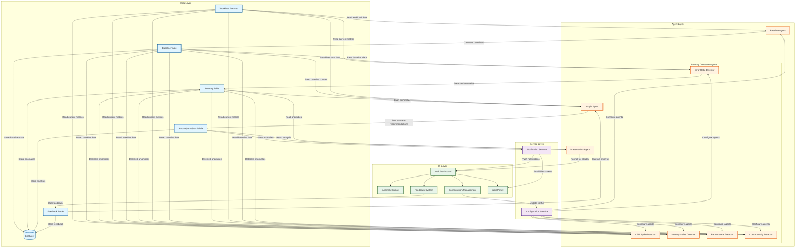

# Cloud Workload Anomaly Detection System - Architecture

## System Architecture Diagram



## Component Descriptions

### Data Layer (BigQuery)

#### **Workload Dataset**
- Source data containing cloud workload metrics
- Columns: CPU utilization, memory consumption, error rates, execution times
- Updated continuously from cloud infrastructure

#### **Baseline Table**
- Stores calculated baseline statistics for each metric
- Generated by Baseline Agent
- Contains: mean, std_dev, percentiles, confidence intervals

#### **Anomaly Table**
- Stores detected anomalies
- Contains: anomaly_id, metric_name, current_value, baseline_value, deviation_sigma, severity

#### **Anomaly Analysis Table**
- Stores detailed analysis of each anomaly
- Contains: root_cause, recommendations, impact_assessment, confidence_score

#### **Feedback Table**
- Stores user feedback on anomaly analyses
- Used to improve future detections and recommendations

---

### Agent Layer

#### **Baseline Agent**
- **Input**: Workload Dataset from BigQuery
- **Process**: 
  - Calculates statistical baselines for each metric
  - Uses AI-optimization to select best calculation method
  - Computes mean, standard deviation, percentiles
- **Output**: Baseline statistics stored in Baseline Table

#### **Anomaly Detection Agents** (Multiple Specialized Agents)

1. **Error Rate Detector**
   - Monitors error rate anomalies
   - Detects stability issues

2. **CPU Spike Detector**
   - Monitors CPU utilization
   - Detects resource bottlenecks

3. **Memory Spike Detector**
   - Monitors memory consumption
   - Detects memory leaks and spikes

4. **Performance Detector**
   - Monitors execution times
   - Detects performance degradation

5. **Cost Anomaly Detector**
   - Monitors resource costs
   - Detects unexpected cost increases

**Common Process**:
- **Input**: Current metrics from Workload Dataset + Baseline data
- **Process**: Compare current values against baselines using statistical methods (z-score, percentile)
- **Output**: Detected anomalies stored in Anomaly Table

#### **Insight Agent**
- **Input**: 
  - Detected anomalies from Anomaly Table
  - Baseline context from Baseline Table
  - Historical data from Workload Dataset
- **Process**:
  - Performs root cause analysis using AI (Gemini)
  - Generates actionable recommendations
  - Assesses business impact
  - Detects correlations and patterns
- **Output**: Detailed analysis stored in Anomaly Analysis Table

#### **Presentation Agent**
- **Input**: 
  - Anomaly analysis from Anomaly Analysis Table
  - Anomaly details from Anomaly Table
- **Process**:
  - Formats data for UI consumption
  - Creates human-readable summaries
  - Prioritizes information
  - Generates visualizations data
- **Output**: Formatted data sent to UI Layer

---

### Service Layer

#### **Notification Service**
- **Input**: New anomalies from Anomaly Analysis Table
- **Process**:
  - Monitors for new high-severity anomalies
  - Sends real-time notifications
  - Manages notification preferences
- **Output**: 
  - Push notifications to UI
  - Email/Slack alerts
  - Updates Alert Panel

#### **Configuration Service**
- **Input**: Configuration changes from UI
- **Process**:
  - Manages system configuration
  - Updates agent parameters
  - Controls detection thresholds
- **Output**: Configuration updates to all agents

---

### UI Layer

#### **Web Dashboard**
- Central interface for all system interactions
- Displays real-time system status

#### **Anomaly Display**
- Shows detected anomalies with details
- Displays root cause analysis
- Shows recommendations and impact
- Provides historical anomaly trends

#### **Configuration Management**
- Allows users to configure:
  - Detection thresholds
  - Baseline calculation methods
  - Notification preferences
  - Agent enable/disable

#### **Feedback System**
- Allows users to provide feedback on:
  - Accuracy of anomaly detection
  - Usefulness of recommendations
  - False positives/negatives
- Feedback stored in Feedback Table for continuous improvement

#### **Alert Panel**
- Displays real-time notifications
- Shows new anomalies as they're detected
- Provides quick action buttons

---

## Data Flow Summary

1. **Baseline Calculation Flow**:
   ```
   Workload Dataset → Baseline Agent → Baseline Table
   ```

2. **Anomaly Detection Flow**:
   ```
   Workload Dataset + Baseline Table → Detection Agents → Anomaly Table
   ```

3. **Analysis Flow**:
   ```
   Anomaly Table + Baseline Table + Workload Dataset → Insight Agent → Anomaly Analysis Table
   ```

4. **Presentation Flow**:
   ```
   Anomaly Analysis Table + Anomaly Table → Presentation Agent → UI Layer
   ```

5. **Notification Flow**:
   ```
   Anomaly Analysis Table → Notification Service → UI Layer + External Alerts
   ```

6. **Feedback Loop**:
   ```
   UI Feedback System → Feedback Table → Insight Agent (for improvement)
   ```

---

## Key Features

### 🔄 **Continuous Monitoring**
- Agents run continuously or on schedule
- Real-time anomaly detection
- Automatic baseline updates

### 🤖 **AI-Powered Analysis**
- Baseline Agent uses AI to optimize calculation methods
- Insight Agent uses Gemini for root cause analysis
- Continuous learning from user feedback

### 📊 **Multi-Agent Architecture**
- Specialized agents for different anomaly types
- Parallel processing for faster detection
- Modular design for easy expansion

### 🔔 **Real-Time Notifications**
- Instant alerts for critical anomalies
- Multiple notification channels
- Configurable alert thresholds

### 👥 **User Feedback Integration**
- Users can rate anomaly accuracy
- Feedback improves future detections
- Continuous system improvement

### ⚙️ **Flexible Configuration**
- UI-based configuration management
- Per-agent configuration
- Dynamic threshold adjustment

---

## Technology Stack

- **Data Storage**: Google BigQuery
- **AI/ML**: Vertex AI (Gemini)
- **Backend**: Python (Cloud Functions / Cloud Run)
- **Frontend**: Web Dashboard (React/Vue)
- **Notifications**: Cloud Pub/Sub, Email, Slack
- **Orchestration**: Cloud Scheduler, Cloud Tasks
