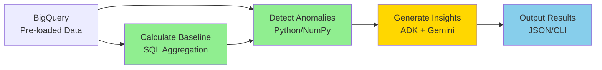
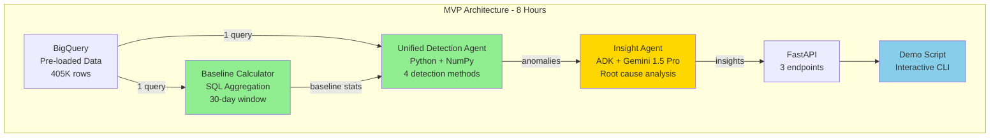

# Multi-Agent Architecture - Critical Review & Improvements

## Review Date
2024-12-16

## Executive Summary

After thorough analysis of the multi-agent architecture against project standards, data characteristics, and hackathon constraints, I've identified **8 critical issues** and **12 improvement opportunities** across 5 categories.

**Overall Assessment**: The architecture is conceptually sound but needs refinement for hackathon MVP scope. Key focus areas: ADK usage optimization, timeline alignment, and cost management.

**Context Clarifications**:
- ✅ BigQuery is pre-loaded with all data (one-time load)
- ✅ MVP works with static dataset (no streaming)
- ✅ Streaming data ingestion is Phase 2
- ✅ Alerting and error handling are "Day 2" items
- ✅ Hackathon goal: Rough POC, not production-ready

---

## Critical Issues

### 🔴 Category 1: Timeline & Complexity Alignment

#### Issue 1.1: Architecture Complexity vs Hackathon Scope
**Severity**: HIGH  
**Impact**: Implementation timeline risk

**Problem**:
- Architecture defines 6+ specialized agents with orchestration
- Hackathon timeline: 8-10 hours for rough POC
- Each agent requires implementation, testing, and integration

**Realistic Time Estimates**:
- Baseline Agent: 1.5-2 hours (statistics, BigQuery queries)
- 6 Anomaly Agents: 0.5-1 hour each = 3-6 hours
- Insight Agent: 2-3 hours (ADK setup, correlation logic)
- Presentation Agent: 1-2 hours (formatting, basic output)
- Orchestration: 2-3 hours (Pub/Sub, scheduling)
- **Total: 10-16 hours**

**Recommendation for MVP**:
```
HACKATHON MVP (8 hours):
✅ Unified detection agent (combines all 6 detectors)
✅ Single ADK insight agent
✅ Simple sequential pipeline (no Pub/Sub initially)
✅ REST API with 2-3 endpoints
✅ CLI demo script

POST-HACKATHON:
- Split into specialized agents
- Add Pub/Sub orchestration
- Build web dashboard
```

**Benefits of Simplified Approach**:
- Faster implementation (8 hours vs 16 hours)
- Easier debugging (linear flow)
- Still demonstrates multi-agent concept
- Can evolve to full architecture later

---

#### Issue 1.2: Missing Incremental Milestones
**Severity**: MEDIUM  
**Impact**: Risk of incomplete demo

**Problem**:
- No clear "minimum viable" subset defined
- All-or-nothing implementation approach
- Risk: 80% complete = 0% functional for demo

**Recommendation**:
Define 3 working milestones:

**Milestone 1 (Hour 4)**: Basic Detection
- Load data from BigQuery
- Detect 1 type of anomaly (CPU spike)
- Output: JSON list of anomalies
- **Demo**: Show detected anomalies

**Milestone 2 (Hour 6)**: AI Insights
- Add ADK agent
- Generate explanation for 1 anomaly
- Output: Natural language explanation
- **Demo**: Show AI-generated insight

**Milestone 3 (Hour 8)**: Complete Flow
- Add multiple detection types
- Add correlation with migrations
- Add REST API
- **Demo**: Full end-to-end workflow

---

### 🔴 Category 2: ADK Usage & Standards Compliance

#### Issue 2.1: Inappropriate ADK Usage for Statistical Detection
**Severity**: HIGH  
**Impact**: Performance, cost, standards violation

**Problem**:
The architecture uses ADK/Gemini for ALL agents, including simple statistical calculations:

```python
# Current design - INEFFICIENT
cpu_agent = reasoning_engines.LangchainAgent(
    model="gemini-1.5-pro",  # Expensive LLM for Z-score!
    tools=[detect_anomaly],   # Simple math operation
)
```

**Why This Is Wrong**:
1. **Performance**: Z-score in Python = 1ms, via LLM = 500-1000ms
2. **Cost**: NumPy = $0.00, Gemini = $0.01-0.05 per detection
3. **Reliability**: LLM adds unnecessary failure points
4. **Standards**: ADK should be used where it adds value

**Correct Approach**:
```python
# Detection: Pure Python (fast, cheap, reliable)
def detect_cpu_anomaly(metrics, baseline):
    """Simple statistical detection - no LLM needed"""
    z_score = (metrics.cpu - baseline.mean) / baseline.std
    return z_score > 2.5

# Explanation: ADK (where LLM adds value)
insight_agent = reasoning_engines.LangchainAgent(
    model="gemini-1.5-pro",
    tools=[correlate_events, query_migrations],
    system_instruction="""
    Analyze the anomaly and explain WHY it occurred.
    Correlate with migration events and provide recommendations.
    """
)
```

**ADK Should Be Used For**:
- ✅ Root cause analysis (Insight Agent)
- ✅ Natural language explanations
- ✅ Recommendation generation
- ✅ Complex correlation reasoning
- ✅ Pattern recognition in unstructured data

**ADK Should NOT Be Used For**:
- ❌ Statistical calculations (Z-score, mean, std dev)
- ❌ Simple threshold checks
- ❌ Data queries (use BigQuery directly)
- ❌ Formatting/presentation (use templates)

---

#### Issue 2.2: Missing ADK Justification Documentation
**Severity**: MEDIUM  
**Impact**: Standards non-compliance

**Problem**:
- STANDARDS.md requires justification when ADK is NOT used
- Architecture doesn't explain ADK usage decisions
- No cost/benefit analysis provided

**Recommendation**:
Create `docs/ADK_USAGE_JUSTIFICATION.md`:

```markdown
# ADK Usage Justification

## Components Using ADK

### Insight Agent ✅
**Why ADK**: 
- Requires natural language generation
- Complex correlation reasoning
- Recommendation synthesis
- Benefits from LLM's reasoning capabilities

**Cost**: ~$0.50/day (50 insights × 20K tokens)
**Alternative**: Rule-based system (would miss nuanced patterns)
**Decision**: ADK is appropriate

## Components NOT Using ADK

### Detection Agents ❌
**Why NOT ADK**:
- Simple statistical calculations (Z-score, percentiles)
- Deterministic logic (no reasoning needed)
- Performance critical (sub-second response)
- Cost prohibitive (288 runs/day × 6 agents)

**Cost Comparison**:
- With ADK: ~$0.43/day
- Without ADK: ~$0.00/day
**Decision**: Pure Python is appropriate

### Baseline Agent ❌
**Why NOT ADK**:
- SQL aggregations (AVG, STDDEV, PERCENTILE)
- BigQuery handles efficiently
- No reasoning required

**Decision**: SQL is appropriate
```

---

### 🔴 Category 3: Data Architecture

#### Issue 3.1: Baseline Calculation Strategy Unclear
**Severity**: MEDIUM  
**Impact**: Performance and accuracy

**Problem**:
Architecture says "calculate baselines" but doesn't specify:
- How much historical data to use?
- How often to recalculate?
- How to handle seasonality?

**Given Context** (BigQuery pre-loaded):
- 405,894 rows of borg traces (20 years)
- 5,000 rows of cloud workload data
- Data is static for MVP

**Recommendation**:
```python
# MVP Baseline Strategy
def calculate_baseline():
    """
    Use last 30 days of data for baseline
    Since data is static, calculate once and cache
    """
    query = """
    SELECT
        AVG(cpu_utilization) as cpu_mean,
        STDDEV(cpu_utilization) as cpu_std,
        APPROX_QUANTILES(cpu_utilization, 100)[OFFSET(50)] as cpu_p50,
        APPROX_QUANTILES(cpu_utilization, 100)[OFFSET(95)] as cpu_p95,
        APPROX_QUANTILES(cpu_utilization, 100)[OFFSET(99)] as cpu_p99,
        
        AVG(memory_consumption) as mem_mean,
        STDDEV(memory_consumption) as mem_std,
        APPROX_QUANTILES(memory_consumption, 100)[OFFSET(95)] as mem_p95
    FROM `project.dataset.workload_metrics`
    WHERE timestamp >= TIMESTAMP_SUB(CURRENT_TIMESTAMP(), INTERVAL 30 DAY)
    """
    
    # Query returns 1 row - instant execution
    # Cache result for entire demo
    return bigquery.query(query).to_dataframe()
```

**Benefits**:
- Single query (< 1 second)
- Returns aggregated stats (not raw data)
- Can be cached for MVP
- Scales to production (just change interval)

---

#### Issue 3.2: Anomaly Detection Window Not Specified
**Severity**: MEDIUM  
**Impact**: Detection accuracy

**Problem**:
- Architecture says "detect anomalies" but doesn't specify time window
- For MVP with static data, need to define what to analyze

**Recommendation**:
```python
# MVP Detection Strategy
def detect_anomalies_in_window():
    """
    For demo: Analyze last 24 hours of data
    Compare against 30-day baseline
    """
    query = """
    SELECT
        timestamp,
        job_id,
        cpu_utilization,
        memory_consumption,
        task_execution_time,
        error_rate
    FROM `project.dataset.workload_metrics`
    WHERE timestamp >= TIMESTAMP_SUB(CURRENT_TIMESTAMP(), INTERVAL 24 HOUR)
    ORDER BY timestamp DESC
    """
    
    recent_data = bigquery.query(query).to_dataframe()
    baseline = get_cached_baseline()
    
    anomalies = []
    for _, row in recent_data.iterrows():
        if is_anomaly(row, baseline):
            anomalies.append(row)
    
    return anomalies
```

---

### 🔴 Category 4: Cost Management

#### Issue 4.1: No Cost Estimation
**Severity**: MEDIUM  
**Impact**: Budget risk

**Problem**:
- Architecture uses Gemini 1.5 Pro for all agents
- No cost analysis provided
- No budget limits specified

**Cost Analysis** (with corrections):

**Gemini 1.5 Pro Pricing (us-central1)**:
- Input: $1.25 per 1M tokens
- Output: $5.00 per 1M tokens

**MVP Cost (Static Data, Single Demo)**:
```
Baseline Calculation: 1 run
- No LLM needed (SQL only)
- Cost: $0.00

Anomaly Detection: 1 run (demo)
- No LLM needed (Python/NumPy)
- Cost: $0.00

Insight Generation: ~5 anomalies
- Input: 5 × 5K tokens = 25K tokens = $0.03
- Output: 5 × 2K tokens = 10K tokens = $0.05
- Cost: $0.08

Total MVP Cost: ~$0.08
```

**Production Cost (Continuous Operation)**:
```
If running continuously (not needed for MVP):
- Anomaly Detection: 288 runs/day × 0 = $0.00
- Insight Generation: ~50 anomalies/day
  - Input: 50 × 5K = 250K tokens = $0.31
  - Output: 50 × 2K = 100K tokens = $0.50
  - Daily: $0.81
  - Monthly: ~$24.00

With Gemini 1.5 Flash (cheaper):
- Monthly: ~$6.00 (75% savings)
```

**Recommendation**:
- MVP: Use Gemini 1.5 Pro (quality over cost)
- Production: Switch to Gemini 1.5 Flash for cost optimization
- Set budget alert at $5/day

---

#### Issue 4.2: Missing Resource Limits
**Severity**: LOW (for MVP)  
**Impact**: Runaway costs (production concern)

**Problem**:
```python
# Current design - no limits
insight_agent = reasoning_engines.LangchainAgent(
    model="gemini-1.5-pro",
    # No max_tokens
    # No timeout
)
```

**Recommendation** (for production):
```python
insight_agent = reasoning_engines.LangchainAgent(
    model="gemini-1.5-pro",
    max_tokens=2048,      # Limit output
    timeout=30,           # 30 second timeout
    tools=[...],
    system_instruction="""
    You are an insight agent. Be concise.
    Maximum response: 500 words.
    Provide 2-3 specific recommendations.
    """
)
```

---

### 🔴 Category 5: Architecture Clarity

#### Issue 5.1: Parallel Execution Not Truly Parallel
**Severity**: LOW  
**Impact**: Misleading performance claims

**Problem**:
Architecture diagram shows "parallel execution" but doesn't specify implementation:

```mermaid
ORC -->|Schedule| AA1
ORC -->|Schedule| AA2
# How is this parallel?
```

**Reality**:
- Cloud Scheduler triggers are sequential
- "Parallel" means concurrent HTTP requests
- Not true parallelism without explicit async code

**Recommendation for MVP**:
```python
# MVP: Sequential execution (simpler)
def run_detection():
    detectors = [
        detect_cpu_anomaly,
        detect_memory_anomaly,
        detect_error_rate_anomaly,
    ]
    
    anomalies = []
    for detector in detectors:
        result = detector(metrics, baseline)
        if result:
            anomalies.append(result)
    
    return anomalies

# Production: True parallel execution
import asyncio

async def run_detection_parallel():
    tasks = [
        detect_cpu_anomaly_async(metrics, baseline),
        detect_memory_anomaly_async(metrics, baseline),
        detect_error_rate_anomaly_async(metrics, baseline),
    ]
    results = await asyncio.gather(*tasks)
    return [r for r in results if r]
```

---

#### Issue 5.2: Orchestration Complexity for MVP
**Severity**: MEDIUM  
**Impact**: Implementation time

**Problem**:
- Architecture requires Pub/Sub, Cloud Scheduler, state management
- Adds 2-3 hours to implementation
- Not necessary for MVP demo

**Recommendation**:
```python
# MVP: Simple orchestration
def main():
    """Simple sequential pipeline for demo"""
    print("Loading baseline...")
    baseline = calculate_baseline()
    
    print("Detecting anomalies...")
    anomalies = detect_anomalies(baseline)
    
    if anomalies:
        print(f"Found {len(anomalies)} anomalies")
        print("Generating insights...")
        
        for anomaly in anomalies:
            insight = insight_agent.analyze(anomaly)
            print(f"\n{insight.summary}")
            print(f"Confidence: {insight.confidence:.0%}")
            print(f"Recommendations: {insight.recommendations}")
    else:
        print("No anomalies detected")

# Run via CLI for demo
if __name__ == "__main__":
    main()
```

**Production Orchestration** (Phase 2):
- Add Cloud Scheduler for periodic execution
- Add Pub/Sub for event-driven architecture
- Add state management with Firestore
- Add monitoring and alerting

---

## Improvement Opportunities

### 💡 Category 1: MVP Simplification

#### Improvement 1.1: Unified Detection Agent
**Priority**: HIGH  
**Effort**: Low  
**Impact**: Faster implementation

**Current**: 6 separate anomaly agents  
**Proposed**: Single agent with multiple detectors

```python
class UnifiedDetectionAgent:
    """Single agent that runs multiple detection methods"""
    
    def __init__(self, baseline):
        self.baseline = baseline
        self.detectors = {
            'cpu_spike': self.detect_cpu_spike,
            'memory_spike': self.detect_memory_spike,
            'error_rate': self.detect_error_rate,
            'latency': self.detect_latency,
        }
    
    def detect_cpu_spike(self, metrics):
        z_score = (metrics.cpu - self.baseline.cpu_mean) / self.baseline.cpu_std
        if z_score > 2.5:
            return {
                'type': 'cpu_spike',
                'severity': 'high' if z_score > 3.5 else 'medium',
                'value': metrics.cpu,
                'baseline': self.baseline.cpu_mean,
                'deviation': z_score
            }
        return None
    
    def run(self, metrics):
        """Run all detectors and return anomalies"""
        anomalies = []
        for name, detector in self.detectors.items():
            if result := detector(metrics):
                anomalies.append(result)
        return anomalies
```

**Benefits**:
- Single codebase (easier to maintain)
- Shared baseline loading (1 query vs 6)
- Faster implementation (1 hour vs 3-6 hours)
- Still demonstrates multi-detection concept

---

#### Improvement 1.2: Simplified Data Flow
**Priority**: HIGH  
**Effort**: Low  
**Impact**: Clearer architecture

**Current**: Complex Pub/Sub orchestration  
**Proposed**: Direct function calls for MVP



**Implementation**:
```python
# Simple pipeline
def detection_pipeline():
    # 1. Calculate baseline (once, cached)
    baseline = calculate_baseline()
    
    # 2. Get recent metrics
    metrics = query_recent_metrics()
    
    # 3. Detect anomalies
    agent = UnifiedDetectionAgent(baseline)
    anomalies = agent.run(metrics)
    
    # 4. Generate insights (only if anomalies found)
    if anomalies:
        insights = []
        for anomaly in anomalies:
            insight = insight_agent.analyze(anomaly)
            insights.append(insight)
        return insights
    
    return []
```

---

### 💡 Category 2: ADK Optimization

#### Improvement 2.1: Optimized Prompt Engineering
**Priority**: HIGH  
**Effort**: Low  
**Impact**: Better quality, lower cost

```python
insight_agent = reasoning_engines.LangchainAgent(
    model="gemini-1.5-pro",
    system_instruction="""
    You are an expert FinOps analyst specializing in cloud workload anomalies.
    
    TASK: Analyze the provided anomaly and explain its root cause.
    
    CONTEXT PROVIDED:
    - Anomaly details (metric, value, deviation)
    - Recent migration events
    - Historical patterns
    
    RESPONSE FORMAT (JSON):
    {
      "root_cause": "One sentence explanation",
      "confidence": 0.85,
      "evidence": [
        "Specific data point 1",
        "Specific data point 2"
      ],
      "recommendations": [
        {
          "priority": "high",
          "action": "Specific actionable step",
          "impact": "Expected outcome"
        }
      ]
    }
    
    RULES:
    - Be specific and data-driven
    - Cite evidence from provided context
    - Maximum 3 recommendations
    - No speculation without data
    - Keep response under 500 words
    """,
    tools=[
        query_migration_events,
        query_historical_patterns,
        correlate_temporal_events
    ],
    max_tokens=1024
)
```

---

#### Improvement 2.2: Tool Function Optimization
**Priority**: MEDIUM  
**Effort**: Low  
**Impact**: Faster insights

```python
# Efficient tool functions
def query_migration_events(anomaly_timestamp, window_hours=24):
    """
    Query migrations near anomaly time
    Returns only relevant events (not all migrations)
    """
    query = """
    SELECT 
        migration_id,
        start_time,
        end_time,
        source_region,
        target_region,
        workload_count
    FROM migrations
    WHERE start_time BETWEEN 
        TIMESTAMP_SUB(@anomaly_time, INTERVAL @window HOUR)
        AND TIMESTAMP_ADD(@anomaly_time, INTERVAL @window HOUR)
    ORDER BY start_time
    """
    
    return bigquery.query(
        query,
        parameters=[
            bigquery.ScalarQueryParameter('anomaly_time', 'TIMESTAMP', anomaly_timestamp),
            bigquery.ScalarQueryParameter('window', 'INT64', window_hours)
        ]
    ).to_dataframe()
```

---

### 💡 Category 3: Demo Enhancement

#### Improvement 3.1: Interactive Demo Script
**Priority**: HIGH  
**Effort**: Low  
**Impact**: Better presentation

```python
# demo.py - Hackathon presentation script
def run_interactive_demo():
    """
    Interactive demo showing full workflow
    Perfect for hackathon judges
    """
    print("=" * 60)
    print("ANOMALY DETECTION & CORRELATION DEMO")
    print("=" * 60)
    
    # Step 1: Show baseline
    print("\n[1/5] Loading baseline metrics from BigQuery...")
    baseline = calculate_baseline()
    print(f"✓ Baseline calculated from 30 days of data")
    print(f"  CPU: {baseline.cpu_mean:.1f}% ± {baseline.cpu_std:.1f}%")
    print(f"  Memory: {baseline.mem_mean:.0f} MB ± {baseline.mem_std:.0f} MB")
    
    # Step 2: Query recent data
    print("\n[2/5] Querying recent metrics...")
    metrics = query_recent_metrics()
    print(f"✓ Analyzed {len(metrics)} recent data points")
    
    # Step 3: Detect anomalies
    print("\n[3/5] Running anomaly detection...")
    agent = UnifiedDetectionAgent(baseline)
    anomalies = []
    for _, row in metrics.iterrows():
        if result := agent.run(row):
            anomalies.extend(result)
    
    print(f"✓ Detected {len(anomalies)} anomalies")
    for anom in anomalies:
        print(f"  ⚠️  {anom['type']}: {anom['value']:.1f} "
              f"({anom['deviation']:.1f}σ above baseline)")
    
    # Step 4: Generate insights
    if anomalies:
        print("\n[4/5] Generating AI insights with ADK...")
        for i, anomaly in enumerate(anomalies[:3], 1):  # Show top 3
            print(f"\n  Analyzing anomaly {i}/{len(anomalies)}...")
            insight = insight_agent.analyze(anomaly)
            
            print(f"  ✓ Root Cause: {insight.root_cause}")
            print(f"    Confidence: {insight.confidence:.0%}")
            print(f"    Evidence:")
            for evidence in insight.evidence:
                print(f"      • {evidence}")
    
    # Step 5: Show recommendations
    print("\n[5/5] Recommendations:")
    for i, rec in enumerate(insight.recommendations, 1):
        print(f"  {i}. [{rec.priority.upper()}] {rec.action}")
        print(f"     Impact: {rec.impact}")
    
    print("\n" + "=" * 60)
    print("DEMO COMPLETE")
    print("=" * 60)

if __name__ == "__main__":
    run_interactive_demo()
```

---

#### Improvement 3.2: Synthetic Test Data
**Priority**: MEDIUM  
**Effort**: Low  
**Impact**: Reliable demo

```python
def inject_test_anomaly():
    """
    Create synthetic anomaly for reliable demo
    Ensures demo always has something to show
    """
    test_anomaly = {
        'timestamp': datetime.now(),
        'job_id': 'DEMO_JOB_123',
        'cpu_utilization': 95.0,  # 3σ above baseline
        'memory_consumption': 7500.0,  # 2.5σ above baseline
        'task_execution_time': 4500.0,
        'error_rate': 0.05
    }
    
    # Insert into BigQuery for demo
    bigquery.insert_rows('workload_metrics', [test_anomaly])
    
    # Also create corresponding migration event
    test_migration = {
        'migration_id': 'MIG_DEMO_001',
        'start_time': datetime.now() - timedelta(minutes=15),
        'end_time': datetime.now(),
        'source_region': 'us-east1',
        'target_region': 'us-central1',
        'workload_count': 25
    }
    
    bigquery.insert_rows('migrations', [test_migration])
    
    return test_anomaly, test_migration
```

---

### 💡 Category 4: Code Quality

#### Improvement 4.1: Type Hints and Documentation
**Priority**: MEDIUM  
**Effort**: Low  
**Impact**: Better maintainability

```python
from typing import Dict, List, Optional
from dataclasses import dataclass

@dataclass
class Baseline:
    """Statistical baseline for anomaly detection"""
    cpu_mean: float
    cpu_std: float
    cpu_p95: float
    mem_mean: float
    mem_std: float
    mem_p95: float
    calculated_at: datetime

@dataclass
class Anomaly:
    """Detected anomaly"""
    type: str
    timestamp: datetime
    metric_name: str
    value: float
    baseline_value: float
    deviation: float
    severity: str
    confidence: float

def detect_anomalies(
    metrics: pd.DataFrame,
    baseline: Baseline,
    threshold: float = 2.5
) -> List[Anomaly]:
    """
    Detect anomalies using Z-score method
    
    Args:
        metrics: Recent metrics data
        baseline: Statistical baseline
        threshold: Z-score threshold (default: 2.5)
    
    Returns:
        List of detected anomalies
    """
    pass
```

---

#### Improvement 4.2: Configuration Management
**Priority**: MEDIUM  
**Effort**: Low  
**Impact**: Easier tuning

```yaml
# config.yaml
detection:
  threshold: 2.5
  lookback_hours: 24
  min_confidence: 0.7

baseline:
  lookback_days: 30
  refresh_hours: 24

insight:
  model: "gemini-1.5-pro"
  max_tokens: 1024
  temperature: 0.3
  max_recommendations: 3

bigquery:
  project: "ccibt-hack25ww7-730"
  dataset: "anomaly_detection"
  location: "us-central1"
```

```python
# Load configuration
import yaml

with open('config.yaml') as f:
    config = yaml.safe_load(f)

# Use in code
threshold = config['detection']['threshold']
model = config['insight']['model']
```

---

## Recommended MVP Architecture

### Simplified Architecture for Hackathon



**Key Simplifications**:
1. ✅ Single unified detection agent (not 6 separate)
2. ✅ Direct function calls (not Pub/Sub)
3. ✅ ADK only for insights (not detection)
4. ✅ CLI demo (not web dashboard)
5. ✅ Static data (no streaming)
6. ✅ Minimal error handling (Day 2 item)

**Implementation Timeline**:
- **Hour 1-2**: Infrastructure + data loading to BigQuery
- **Hour 3-4**: Baseline calculation + unified detection agent
- **Hour 5-6**: ADK insight agent + correlation logic
- **Hour 7-8**: FastAPI + demo script + testing

---

## Priority Action Items

### 🔥 Critical (Before Implementation)

1. **Update architecture documentation** (30 min)
   - Clarify MVP vs production architecture
   - Document ADK usage decisions
   - Add cost estimates

2. **Create simplified implementation plan** (30 min)
   - Define 3 milestones with working demos
   - Update hour-by-hour roadmap
   - Identify critical path

3. **Set up BigQuery schema** (30 min)
   - Define table structures
   - Load CSV data
   - Test queries

### ⚠️ Important (During Implementation)

4. **Implement unified detection agent** (2 hours)
   - Z-score detection for CPU, memory
   - Threshold detection for error rate
   - Percentile detection for latency

5. **Implement ADK insight agent** (2 hours)
   - Set up Vertex AI Reasoning Engine
   - Create tool functions
   - Test with sample anomalies

6. **Create demo script** (1 hour)
   - Interactive CLI
   - Synthetic test data
   - Clear output formatting

### 💡 Nice to Have (If Time Permits)

7. **Add visualization** (1 hour)
   - Simple matplotlib charts
   - Anomaly timeline
   - Correlation matrix

8. **Build REST API** (1 hour)
   - 3 endpoints (baseline, detect, insights)
   - OpenAPI documentation
   - Basic error handling

---

## Conclusion

The multi-agent architecture is **sound for production but needs simplification for hackathon MVP**. 

**Key Recommendations**:

1. ✅ **Simplify to MVP** - Unified detection agent, direct calls, CLI demo
2. ✅ **Optimize ADK usage** - Only for insights, not detection
3. ✅ **Focus on demo** - Working end-to-end flow over features
4. ✅ **Leverage BigQuery** - Pre-loaded data, SQL aggregations
5. ✅ **Defer complexity** - Pub/Sub, monitoring, error handling to Phase 2

**Timeline Confidence**:
- MVP (simplified): ✅ 8 hours (achievable)
- Full architecture: ⚠️ 16+ hours (post-hackathon)

**Next Steps**:
1. Update IMPLEMENTATION_ROADMAP.md with simplified plan
2. Create ADK_USAGE_JUSTIFICATION.md
3. Begin implementation with Milestone 1

---

**Review Completed By**: IBM Bob (Architect Mode)  
**Date**: 2024-12-16  
**Status**: Ready for implementation with clarified scope