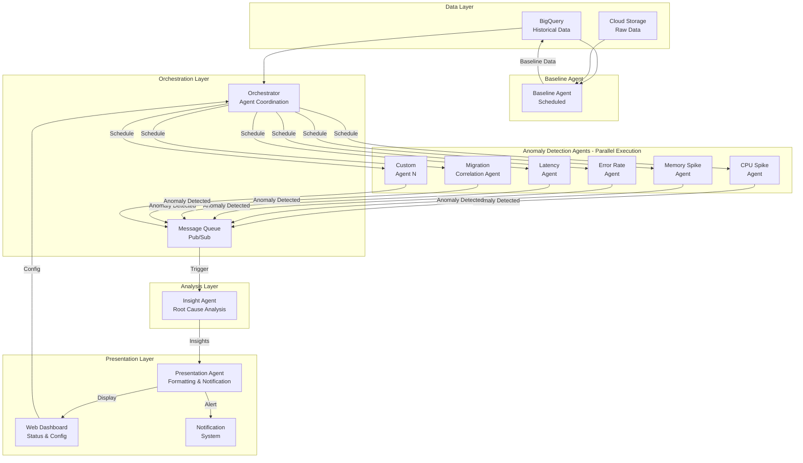
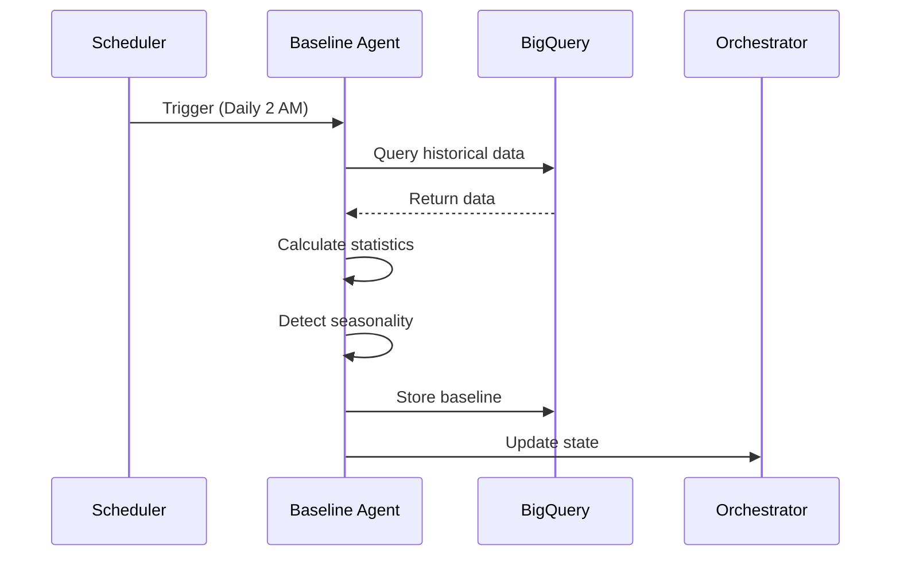
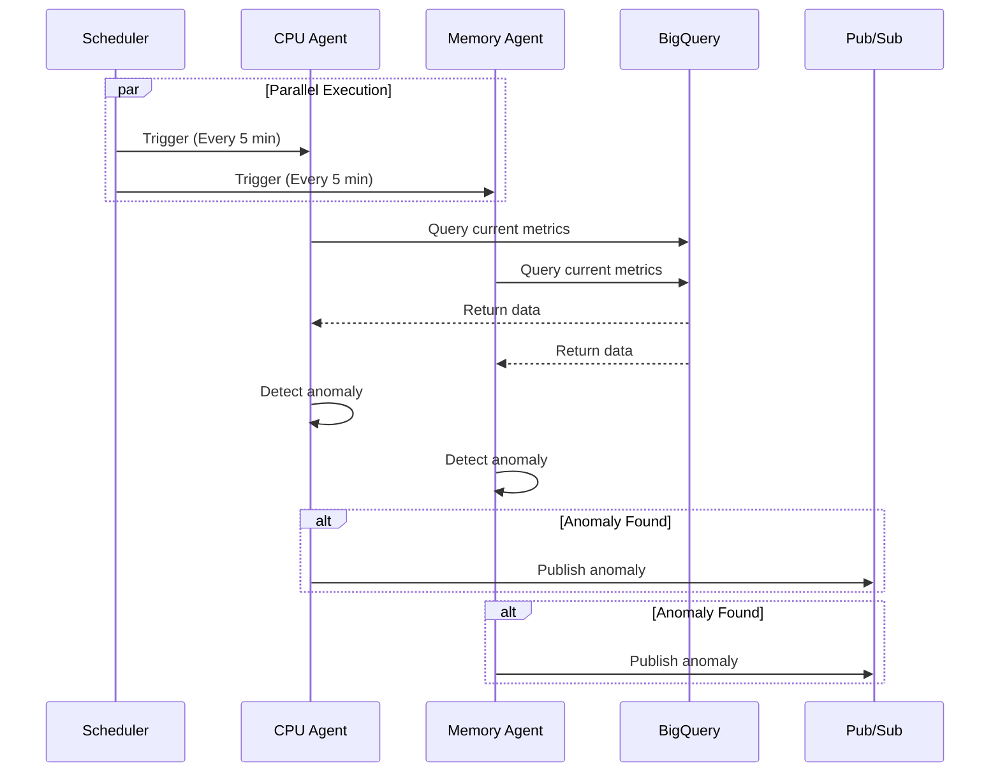
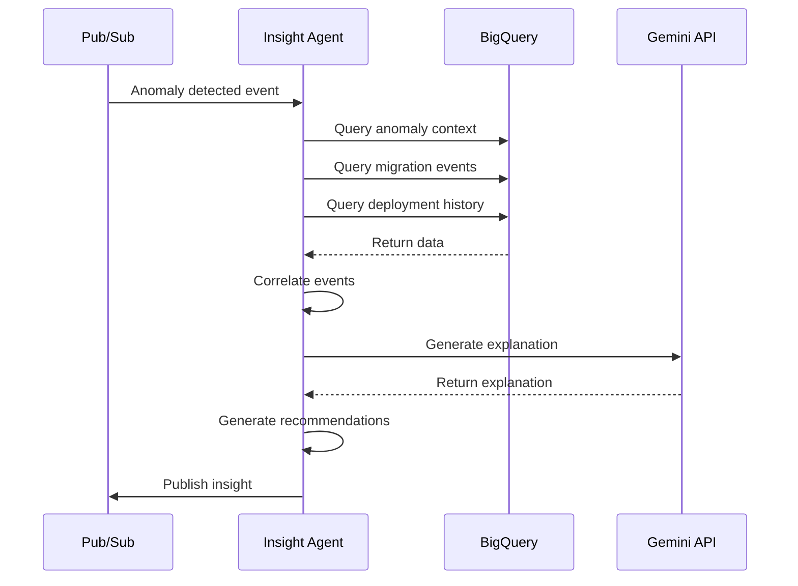
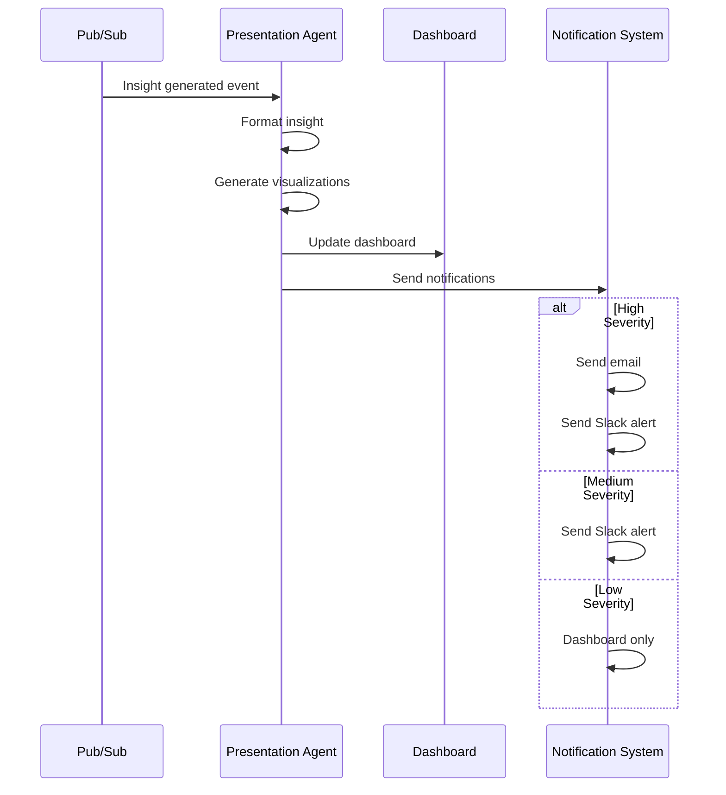

# Multi-Agent Architecture Design

## Overview

The Anomaly Detection System uses a sophisticated multi-agent architecture with specialized agents working in parallel, coordinated by an orchestration layer.

---

## Agent Architecture



---

## Agent Descriptions

### 1. Baseline Agent

**Purpose**: Establish performance baselines for anomaly detection

**Schedule**: 
- Daily at 2:00 AM
- Weekly full recalculation
- On-demand via API

**Responsibilities**:
- Calculate statistical baselines (mean, std dev, percentiles)
- Identify normal patterns and seasonality
- Store baseline metrics in BigQuery
- Update baseline thresholds
- Generate baseline reports

**Outputs**:
```json
{
  "baseline_id": "baseline-2024-12-16",
  "period": "2024-12-01 to 2024-12-15",
  "metrics": {
    "cpu_utilization": {
      "mean": 49.7,
      "std_dev": 23.2,
      "p50": 50.0,
      "p95": 85.0,
      "p99": 89.0
    },
    "memory_consumption": {
      "mean": 4218.1,
      "std_dev": 2142.4,
      "p50": 4235.5,
      "p95": 7500.0,
      "p99": 7900.0
    }
  },
  "seasonality": {
    "hourly_pattern": [...],
    "daily_pattern": [...],
    "weekly_pattern": [...]
  }
}
```

**ADK Implementation**:
```python
baseline_agent = reasoning_engines.LangchainAgent(
    model="gemini-1.5-pro",
    tools=[
        query_historical_data,
        calculate_statistics,
        detect_seasonality,
        store_baseline
    ],
    system_instruction="""
    You are a baseline calculation agent. Your role is to:
    1. Query historical performance data
    2. Calculate statistical baselines
    3. Identify seasonal patterns
    4. Store baseline metrics for anomaly detection
    """
)
```

---

### 2. Anomaly Detection Agents (Parallel)

**Purpose**: Detect specific types of anomalies in real-time

**Schedule**: Every 5 minutes (configurable per agent)

**Agent Types**:

#### 2.1 CPU Spike Agent
- **Detects**: Unusual CPU utilization patterns
- **Threshold**: >2.5 std dev from baseline
- **Method**: Z-score analysis

#### 2.2 Memory Spike Agent
- **Detects**: Memory consumption anomalies
- **Threshold**: >2.5 std dev from baseline
- **Method**: Z-score + trend analysis

#### 2.3 Error Rate Agent
- **Detects**: Elevated error rates
- **Threshold**: >3% error rate or 2x baseline
- **Method**: Statistical + ML (Isolation Forest)

#### 2.4 Latency Agent
- **Detects**: Execution time anomalies
- **Threshold**: >95th percentile of baseline
- **Method**: Time-series analysis

#### 2.5 Migration Correlation Agent
- **Detects**: Performance changes near migration events
- **Threshold**: Temporal correlation >0.7
- **Method**: Temporal + causal analysis

#### 2.6 Custom Agent N
- **Detects**: User-defined anomaly patterns
- **Threshold**: Configurable
- **Method**: Pluggable detection logic

**Common Agent Structure**:
```python
class AnomalyAgent:
    def __init__(self, agent_type, detection_method):
        self.agent_type = agent_type
        self.detection_method = detection_method
        self.adk_agent = self._create_adk_agent()
    
    def _create_adk_agent(self):
        return reasoning_engines.LangchainAgent(
            model="gemini-1.5-pro",
            tools=[
                query_current_metrics,
                query_baseline,
                detect_anomaly,
                publish_anomaly
            ],
            system_instruction=f"""
            You are a {self.agent_type} detection agent.
            Monitor metrics and detect anomalies using {self.detection_method}.
            When anomaly detected, publish to message queue.
            """
        )
    
    def run(self):
        # Query current metrics
        # Compare to baseline
        # Detect anomaly
        # Publish if found
        pass
```

**Anomaly Output**:
```json
{
  "anomaly_id": "anom-cpu-2024-12-16-14-30",
  "agent_type": "cpu_spike",
  "detected_at": "2024-12-16T14:30:00Z",
  "severity": "high",
  "confidence": 0.92,
  "metric": {
    "name": "cpu_utilization",
    "current_value": 125.5,
    "baseline_value": 49.7,
    "deviation": 2.8,
    "deviation_percentage": 152.5
  },
  "affected_resources": [
    {
      "job_id": "JOB_1234",
      "resource_type": "compute_instance"
    }
  ],
  "context": {
    "time_window": "last_15_minutes",
    "related_metrics": {
      "memory": "normal",
      "error_rate": "elevated"
    }
  }
}
```

---

### 3. Insight Agent

**Purpose**: Perform root cause analysis and generate recommendations

**Trigger**: When anomaly detected (event-driven)

**Responsibilities**:
- Analyze anomaly context
- Correlate with other events (migrations, deployments)
- Identify root cause
- Generate actionable recommendations
- Provide confidence scoring

**ADK Implementation**:
```python
insight_agent = reasoning_engines.LangchainAgent(
    model="gemini-1.5-pro",
    tools=[
        query_anomaly_details,
        query_migration_events,
        query_deployment_history,
        correlate_events,
        analyze_root_cause,
        generate_recommendations
    ],
    system_instruction="""
    You are an insight agent specialized in root cause analysis.
    When an anomaly is detected:
    1. Gather all relevant context
    2. Correlate with recent events (migrations, deployments)
    3. Identify the most likely root cause
    4. Generate specific, actionable recommendations
    5. Provide confidence scores for your analysis
    """
)
```

**Insight Output**:
```json
{
  "insight_id": "insight-2024-12-16-14-35",
  "anomaly_id": "anom-cpu-2024-12-16-14-30",
  "root_cause": {
    "primary": "workload_migration",
    "confidence": 0.85,
    "explanation": "CPU spike correlates strongly with migration of workload-xyz from us-east1 to us-central1. Migration started at 14:15, spike detected at 14:30.",
    "supporting_evidence": [
      "Temporal correlation: 0.92",
      "Migration involved 25 compute instances",
      "Similar pattern observed in previous migrations"
    ]
  },
  "contributing_factors": [
    {
      "factor": "insufficient_resource_allocation",
      "confidence": 0.65,
      "explanation": "Target region may have insufficient capacity"
    }
  ],
  "recommendations": [
    {
      "priority": "high",
      "action": "Review migration schedule",
      "rationale": "Avoid peak hours for large migrations",
      "estimated_impact": "Reduce spike probability by 70%"
    },
    {
      "priority": "medium",
      "action": "Implement gradual migration",
      "rationale": "Migrate in smaller batches to reduce impact",
      "estimated_impact": "Reduce spike magnitude by 50%"
    },
    {
      "priority": "low",
      "action": "Set up proactive alerts",
      "rationale": "Early warning for future migrations",
      "estimated_impact": "Reduce response time by 80%"
    }
  ],
  "analysis_metadata": {
    "processing_time_ms": 1567,
    "data_sources_consulted": 3,
    "reasoning_steps": 7
  }
}
```

---

### 4. Presentation Agent

**Purpose**: Format insights and trigger notifications

**Trigger**: When insight generated (event-driven)

**Responsibilities**:
- Format insights for human consumption
- Generate visualizations
- Trigger appropriate notifications
- Update dashboard
- Create audit trail

**ADK Implementation**:
```python
presentation_agent = reasoning_engines.LangchainAgent(
    model="gemini-1.5-pro",
    tools=[
        format_insight,
        generate_summary,
        create_visualization,
        send_notification,
        update_dashboard
    ],
    system_instruction="""
    You are a presentation agent. Your role is to:
    1. Take technical insights and make them human-readable
    2. Create clear, actionable summaries
    3. Generate appropriate visualizations
    4. Trigger notifications based on severity
    5. Update the dashboard with new findings
    """
)
```

**Presentation Output**:
```json
{
  "presentation_id": "pres-2024-12-16-14-40",
  "insight_id": "insight-2024-12-16-14-35",
  "summary": {
    "title": "High CPU Spike Detected - Migration Related",
    "severity": "high",
    "one_liner": "CPU usage increased 152% due to workload migration",
    "impact": "25 compute instances affected",
    "status": "active"
  },
  "formatted_explanation": "At 14:30 UTC, we detected a significant CPU spike (152% above baseline). Analysis shows this correlates strongly with the migration of workload-xyz from us-east1 to us-central1 that started at 14:15. This pattern is consistent with previous large-scale migrations.",
  "visualizations": [
    {
      "type": "time_series",
      "title": "CPU Utilization - Last Hour",
      "data_url": "/api/v1/visualizations/cpu-spike-123"
    },
    {
      "type": "correlation_matrix",
      "title": "Event Correlation",
      "data_url": "/api/v1/visualizations/correlation-456"
    }
  ],
  "notifications": [
    {
      "channel": "email",
      "recipients": ["ops-team@company.com"],
      "sent_at": "2024-12-16T14:40:00Z"
    },
    {
      "channel": "slack",
      "channel_id": "#ops-alerts",
      "sent_at": "2024-12-16T14:40:05Z"
    }
  ],
  "dashboard_update": {
    "updated_at": "2024-12-16T14:40:10Z",
    "sections": ["active_anomalies", "recent_insights"]
  }
}
```

---

### 5. Orchestration Layer

**Purpose**: Coordinate all agents and manage data flow

**Components**:
- **Scheduler**: Manages agent execution schedules
- **Message Queue**: Pub/Sub for agent communication
- **State Manager**: Tracks agent states and workflows
- **Configuration Manager**: Manages agent configurations

**Orchestrator Implementation**:
```python
class Orchestrator:
    def __init__(self):
        self.scheduler = CloudScheduler()
        self.pubsub = PubSubClient()
        self.state_manager = StateManager()
        self.config_manager = ConfigManager()
    
    def schedule_baseline_agent(self):
        """Schedule baseline agent - daily at 2 AM"""
        self.scheduler.create_job(
            name="baseline-agent",
            schedule="0 2 * * *",  # Cron: 2 AM daily
            target=self.run_baseline_agent
        )
    
    def schedule_anomaly_agents(self):
        """Schedule anomaly agents - every 5 minutes"""
        agents = self.config_manager.get_anomaly_agents()
        for agent in agents:
            self.scheduler.create_job(
                name=f"anomaly-agent-{agent.type}",
                schedule="*/5 * * * *",  # Every 5 minutes
                target=lambda: self.run_anomaly_agent(agent)
            )
    
    def setup_event_handlers(self):
        """Setup Pub/Sub event handlers"""
        # Anomaly detected -> Trigger Insight Agent
        self.pubsub.subscribe(
            topic="anomaly-detected",
            callback=self.trigger_insight_agent
        )
        
        # Insight generated -> Trigger Presentation Agent
        self.pubsub.subscribe(
            topic="insight-generated",
            callback=self.trigger_presentation_agent
        )
    
    def run_baseline_agent(self):
        """Execute baseline agent"""
        agent = BaselineAgent()
        result = agent.run()
        self.state_manager.update_state("baseline", result)
    
    def run_anomaly_agent(self, agent_config):
        """Execute anomaly detection agent"""
        agent = AnomalyAgent(agent_config)
        anomalies = agent.run()
        
        for anomaly in anomalies:
            self.pubsub.publish(
                topic="anomaly-detected",
                message=anomaly
            )
    
    def trigger_insight_agent(self, anomaly):
        """Trigger insight agent for anomaly"""
        agent = InsightAgent()
        insight = agent.analyze(anomaly)
        
        self.pubsub.publish(
            topic="insight-generated",
            message=insight
        )
    
    def trigger_presentation_agent(self, insight):
        """Trigger presentation agent for insight"""
        agent = PresentationAgent()
        presentation = agent.format(insight)
        
        # Update dashboard
        # Send notifications
```

---

## Data Flow

### Flow 1: Baseline Calculation (Scheduled)



### Flow 2: Anomaly Detection (Continuous)



### Flow 3: Insight Generation (Event-Driven)



### Flow 4: Presentation (Event-Driven)



---

## Agent Configuration

### Configuration Schema

```yaml
agents:
  baseline:
    enabled: true
    schedule: "0 2 * * *"  # Daily at 2 AM
    lookback_days: 30
    model: "gemini-1.5-pro"
    
  anomaly_detection:
    - type: "cpu_spike"
      enabled: true
      schedule: "*/5 * * * *"  # Every 5 minutes
      threshold: 2.5
      method: "z_score"
      model: "gemini-1.5-pro"
      
    - type: "memory_spike"
      enabled: true
      schedule: "*/5 * * * *"
      threshold: 2.5
      method: "z_score"
      model: "gemini-1.5-pro"
      
    - type: "error_rate"
      enabled: true
      schedule: "*/5 * * * *"
      threshold: 3.0
      method: "isolation_forest"
      model: "gemini-1.5-pro"
      
    - type: "latency"
      enabled: true
      schedule: "*/10 * * * *"  # Every 10 minutes
      threshold_percentile: 95
      method: "time_series"
      model: "gemini-1.5-pro"
      
    - type: "migration_correlation"
      enabled: true
      schedule: "*/15 * * * *"  # Every 15 minutes
      correlation_threshold: 0.7
      time_window_minutes: 60
      model: "gemini-1.5-pro"
  
  insight:
    enabled: true
    trigger: "event_driven"
    model: "gemini-1.5-pro"
    max_concurrent: 5
    
  presentation:
    enabled: true
    trigger: "event_driven"
    model: "gemini-1.5-pro"
    notifications:
      email:
        enabled: true
        recipients: ["ops-team@company.com"]
      slack:
        enabled: true
        channel: "#ops-alerts"
      pagerduty:
        enabled: false
```

---

## Scalability & Performance

### Parallel Execution

- **Anomaly agents run in parallel** for maximum throughput
- Each agent is independent and stateless
- Horizontal scaling: Add more agent instances
- Load balancing across agent instances

### Performance Optimizations

1. **Caching**: Cache baseline data for 1 hour
2. **Batch Processing**: Process multiple metrics in single query
3. **Async Execution**: Non-blocking agent execution
4. **Resource Limits**: CPU/memory limits per agent
5. **Timeout Handling**: 5-minute timeout per agent run

### Monitoring

- Agent execution metrics
- Success/failure rates
- Processing times
- Queue depths
- Resource utilization

---

## Adding New Anomaly Agents

### Step 1: Define Agent Configuration

```yaml
- type: "custom_pattern"
  enabled: true
  schedule: "*/5 * * * *"
  threshold: 2.0
  method: "custom_ml_model"
  model: "gemini-1.5-pro"
  custom_params:
    model_path: "gs://models/custom_pattern.pkl"
    features: ["cpu", "memory", "network"]
```

### Step 2: Implement Agent Class

```python
class CustomPatternAgent(AnomalyAgent):
    def __init__(self, config):
        super().__init__("custom_pattern", config.method)
        self.threshold = config.threshold
        self.model = self.load_model(config.custom_params.model_path)
    
    def detect(self, metrics):
        # Custom detection logic
        prediction = self.model.predict(metrics)
        if prediction > self.threshold:
            return self.create_anomaly(metrics, prediction)
        return None
```

### Step 3: Register with Orchestrator

```python
orchestrator.register_agent(CustomPatternAgent, config)
```

---

## Benefits of Multi-Agent Architecture

### 1. Scalability
- Parallel execution of detection agents
- Easy to add new agent types
- Horizontal scaling

### 2. Maintainability
- Each agent has single responsibility
- Independent development and testing
- Easy to update individual agents

### 3. Performance
- Parallel processing reduces latency
- Event-driven architecture for efficiency
- Optimized resource utilization

### 4. Flexibility
- Easy to enable/disable agents
- Configurable schedules and thresholds
- Pluggable detection methods

### 5. Reliability
- Agent failures don't affect others
- Retry mechanisms
- State management and recovery

---

**Document Version**: 1.0  
**Last Updated**: 2024-12-16  
**Architecture**: Multi-Agent with Orchestration