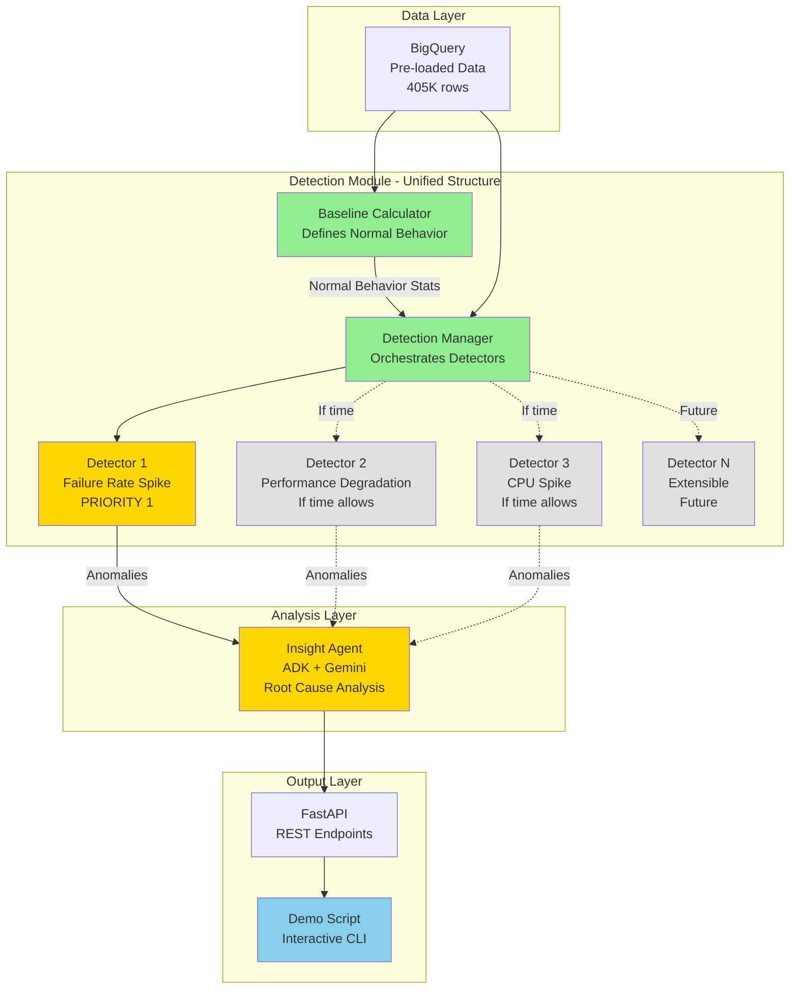
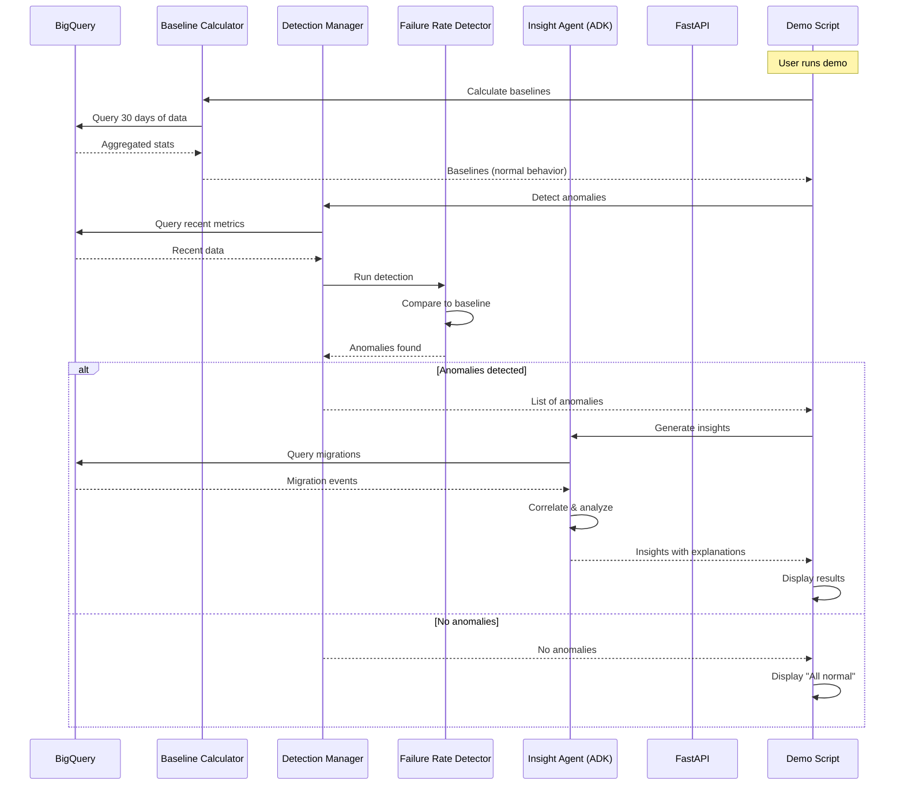

# MVP Architecture - Hackathon Implementation

## Overview

Simplified architecture for 8-hour hackathon implementation with extensibility for future multi-agent expansion.

**Strategy**: Start with unified structure, design for easy separation later

---

## Design Principles

1. **Single Combined Structure**: One detection module with pluggable detectors
2. **Start with One Anomaly**: Implement one detection type first, add more as time allows
3. **Extensible Design**: Easy to split into separate agents later
4. **Baseline-Driven**: Establish "normal" behavior, detect deviations

---

## MVP Architecture Diagram



---

## Component Details

### 1. Baseline Calculator

**Purpose**: Define "normal" behavior for each metric

**What is Normal**:
- Average failure rate over 30 days
- Typical performance metrics (execution time, throughput)
- Standard resource utilization patterns
- Expected error rates

**Implementation**:
```python
class BaselineCalculator:
    """
    Calculates statistical baselines to define normal behavior
    """
    
    def calculate_baseline(self, metric_name: str, lookback_days: int = 30):
        """
        Calculate what is "normal" for a given metric
        
        Returns:
            Baseline with mean, std_dev, percentiles
        """
        query = f"""
        SELECT
            AVG({metric_name}) as mean,
            STDDEV({metric_name}) as std_dev,
            APPROX_QUANTILES({metric_name}, 100)[OFFSET(50)] as p50,
            APPROX_QUANTILES({metric_name}, 100)[OFFSET(95)] as p95,
            APPROX_QUANTILES({metric_name}, 100)[OFFSET(99)] as p99,
            MIN({metric_name}) as min_value,
            MAX({metric_name}) as max_value
        FROM workload_metrics
        WHERE timestamp >= TIMESTAMP_SUB(CURRENT_TIMESTAMP(), INTERVAL {lookback_days} DAY)
        """
        
        result = self.bigquery.query(query).to_dataframe()
        
        return Baseline(
            metric_name=metric_name,
            mean=result['mean'][0],
            std_dev=result['std_dev'][0],
            p50=result['p50'][0],
            p95=result['p95'][0],
            p99=result['p99'][0],
            min_value=result['min_value'][0],
            max_value=result['max_value'][0],
            calculated_at=datetime.now(),
            lookback_days=lookback_days
        )
    
    def calculate_all_baselines(self):
        """Calculate baselines for all metrics"""
        metrics = [
            'failure_rate',           # Priority 1
            'task_execution_time',    # If time allows
            'cpu_utilization',        # If time allows
            'memory_consumption',     # If time allows
        ]
        
        baselines = {}
        for metric in metrics:
            baselines[metric] = self.calculate_baseline(metric)
        
        return baselines
```

**Example Baseline Output**:
```json
{
  "failure_rate": {
    "mean": 0.228,
    "std_dev": 0.042,
    "p50": 0.225,
    "p95": 0.310,
    "p99": 0.350,
    "min_value": 0.150,
    "max_value": 0.400,
    "calculated_at": "2024-12-16T10:00:00Z",
    "lookback_days": 30
  }
}
```

---

### 2. Detection Manager

**Purpose**: Orchestrate multiple detectors, easy to add/remove

**Design for Extensibility**:
```python
class DetectionManager:
    """
    Manages multiple detectors in a unified structure
    Easy to split into separate agents later
    """
    
    def __init__(self, baselines: Dict[str, Baseline]):
        self.baselines = baselines
        self.detectors = []
        
        # Register detectors (easy to add/remove)
        self.register_detector(FailureRateDetector(baselines['failure_rate']))
        
        # Add more as time allows
        # self.register_detector(PerformanceDetector(baselines['task_execution_time']))
        # self.register_detector(CPUSpikeDetector(baselines['cpu_utilization']))
    
    def register_detector(self, detector):
        """Add a detector to the manager"""
        self.detectors.append(detector)
        print(f"Registered detector: {detector.name}")
    
    def detect_all(self, metrics: pd.DataFrame) -> List[Anomaly]:
        """
        Run all registered detectors
        Returns combined list of anomalies
        """
        all_anomalies = []
        
        for detector in self.detectors:
            try:
                anomalies = detector.detect(metrics)
                if anomalies:
                    all_anomalies.extend(anomalies)
                    print(f"✓ {detector.name}: Found {len(anomalies)} anomalies")
                else:
                    print(f"✓ {detector.name}: No anomalies")
            except Exception as e:
                print(f"✗ {detector.name}: Error - {e}")
        
        return all_anomalies
```

**Benefits**:
- Single entry point for all detection
- Easy to add new detectors
- Can split into separate agents later by moving detectors to separate services
- Shared baseline loading (efficient)

---

### 3. Priority 1 Detector: Failure Rate Spike

**Why This First**:
- Clear business impact (failures = problems)
- Easy to detect (simple threshold)
- Good for demo (obvious anomaly)
- Correlates well with migrations

**Implementation**:
```python
class FailureRateDetector:
    """
    Detects spikes in failure rate
    
    Normal behavior: ~22.8% failure rate (from data analysis)
    Anomaly: Significant deviation from baseline
    """
    
    def __init__(self, baseline: Baseline):
        self.name = "Failure Rate Spike Detector"
        self.baseline = baseline
        self.threshold_sigma = 2.5  # 2.5 standard deviations
    
    def detect(self, metrics: pd.DataFrame) -> List[Anomaly]:
        """
        Detect failure rate anomalies
        
        Logic:
        1. Calculate current failure rate
        2. Compare to baseline (normal behavior)
        3. Flag if deviation > threshold
        """
        anomalies = []
        
        for _, row in metrics.iterrows():
            # Calculate failure rate for this time window
            failure_rate = row['failed'] if 'failed' in row else 0
            
            # Calculate deviation from normal
            z_score = (failure_rate - self.baseline.mean) / self.baseline.std_dev
            
            # Check if this deviates from normal behavior
            if abs(z_score) > self.threshold_sigma:
                severity = self._calculate_severity(z_score)
                
                anomaly = Anomaly(
                    type='failure_rate_spike',
                    timestamp=row['timestamp'],
                    metric_name='failure_rate',
                    current_value=failure_rate,
                    baseline_value=self.baseline.mean,
                    deviation_sigma=z_score,
                    deviation_percentage=((failure_rate - self.baseline.mean) / self.baseline.mean) * 100,
                    severity=severity,
                    confidence=self._calculate_confidence(z_score),
                    affected_resources=self._get_affected_resources(row),
                    context={
                        'baseline_p95': self.baseline.p95,
                        'baseline_p99': self.baseline.p99,
                        'is_above_p99': failure_rate > self.baseline.p99
                    }
                )
                
                anomalies.append(anomaly)
        
        return anomalies
    
    def _calculate_severity(self, z_score: float) -> str:
        """Determine severity based on deviation"""
        abs_z = abs(z_score)
        if abs_z > 4.0:
            return 'critical'
        elif abs_z > 3.5:
            return 'high'
        elif abs_z > 2.5:
            return 'medium'
        else:
            return 'low'
    
    def _calculate_confidence(self, z_score: float) -> float:
        """Calculate confidence in anomaly detection"""
        # Higher deviation = higher confidence
        abs_z = abs(z_score)
        if abs_z > 4.0:
            return 0.95
        elif abs_z > 3.5:
            return 0.90
        elif abs_z > 3.0:
            return 0.85
        else:
            return 0.75
    
    def _get_affected_resources(self, row) -> List[Dict]:
        """Extract affected resources from row"""
        return [{
            'job_id': row.get('job_id', 'unknown'),
            'collection_id': row.get('collection_id', 'unknown'),
            'machine_id': row.get('machine_id', 'unknown')
        }]
```

**Example Detection Output**:
```json
{
  "type": "failure_rate_spike",
  "timestamp": "2024-12-16T14:30:00Z",
  "metric_name": "failure_rate",
  "current_value": 0.45,
  "baseline_value": 0.228,
  "deviation_sigma": 5.3,
  "deviation_percentage": 97.4,
  "severity": "critical",
  "confidence": 0.95,
  "affected_resources": [
    {
      "job_id": "JOB_1234",
      "collection_id": "COL_567",
      "machine_id": "MACH_890"
    }
  ],
  "context": {
    "baseline_p95": 0.310,
    "baseline_p99": 0.350,
    "is_above_p99": true
  }
}
```

---

### 4. Additional Detectors (If Time Allows)

#### Performance Degradation Detector
```python
class PerformanceDetector:
    """
    Detects performance degradation
    
    Normal behavior: Average execution time from baseline
    Anomaly: Significant increase in execution time
    """
    
    def __init__(self, baseline: Baseline):
        self.name = "Performance Degradation Detector"
        self.baseline = baseline
        self.threshold_sigma = 2.5
    
    def detect(self, metrics: pd.DataFrame) -> List[Anomaly]:
        """Detect performance degradation"""
        # Similar structure to FailureRateDetector
        # Compare task_execution_time to baseline
        pass
```

#### CPU Spike Detector
```python
class CPUSpikeDetector:
    """
    Detects CPU utilization spikes
    
    Normal behavior: Average CPU from baseline
    Anomaly: Significant spike in CPU usage
    """
    
    def __init__(self, baseline: Baseline):
        self.name = "CPU Spike Detector"
        self.baseline = baseline
        self.threshold_sigma = 2.5
    
    def detect(self, metrics: pd.DataFrame) -> List[Anomaly]:
        """Detect CPU spikes"""
        # Similar structure to FailureRateDetector
        # Compare cpu_utilization to baseline
        pass
```

---

### 5. Insight Agent (ADK)

**Purpose**: Explain WHY anomaly occurred, correlate with migrations

**Implementation**:
```python
class InsightAgent:
    """
    Uses ADK to generate insights about anomalies
    """
    
    def __init__(self):
        self.adk_agent = reasoning_engines.LangchainAgent(
            model="gemini-1.5-pro",
            tools=[
                self.query_migration_events,
                self.query_historical_patterns,
                self.correlate_temporal_events
            ],
            system_instruction="""
            You are an expert FinOps analyst specializing in cloud workload anomalies.
            
            TASK: Analyze the provided anomaly and explain its root cause.
            
            FOCUS ON:
            1. Correlation with migration events
            2. Historical patterns
            3. Resource utilization changes
            4. Workload shifts
            
            RESPONSE FORMAT (JSON):
            {
              "root_cause": "One sentence explanation",
              "confidence": 0.85,
              "evidence": [
                "Specific data point 1",
                "Specific data point 2"
              ],
              "migration_correlation": {
                "is_correlated": true,
                "migration_id": "MIG_123",
                "temporal_correlation": 0.92,
                "explanation": "How migration relates to anomaly"
              },
              "recommendations": [
                {
                  "priority": "high",
                  "action": "Specific actionable step",
                  "impact": "Expected outcome"
                }
              ]
            }
            
            RULES:
            - Be specific and data-driven
            - Cite evidence from provided context
            - Maximum 3 recommendations
            - No speculation without data
            """,
            max_tokens=1024
        )
    
    def analyze(self, anomaly: Anomaly) -> Insight:
        """Generate insight for anomaly"""
        # Prepare context
        context = {
            'anomaly': anomaly.to_dict(),
            'time_window': {
                'start': anomaly.timestamp - timedelta(hours=2),
                'end': anomaly.timestamp + timedelta(hours=1)
            }
        }
        
        # Query ADK agent
        response = self.adk_agent.query(
            f"Analyze this anomaly and explain its root cause: {json.dumps(context)}"
        )
        
        # Parse response
        insight_data = json.loads(response)
        
        return Insight(
            anomaly_id=anomaly.id,
            root_cause=insight_data['root_cause'],
            confidence=insight_data['confidence'],
            evidence=insight_data['evidence'],
            migration_correlation=insight_data.get('migration_correlation'),
            recommendations=insight_data['recommendations'],
            generated_at=datetime.now()
        )
    
    def query_migration_events(self, start_time, end_time):
        """Tool function: Query migrations near anomaly"""
        query = """
        SELECT 
            migration_id,
            start_time,
            end_time,
            source_region,
            target_region,
            workload_count,
            migration_type
        FROM migrations
        WHERE start_time BETWEEN @start_time AND @end_time
        ORDER BY start_time
        """
        
        return self.bigquery.query(
            query,
            parameters=[
                bigquery.ScalarQueryParameter('start_time', 'TIMESTAMP', start_time),
                bigquery.ScalarQueryParameter('end_time', 'TIMESTAMP', end_time)
            ]
        ).to_dataframe()
```

---

## Data Flow

### Complete Pipeline



---

## Implementation Timeline

### Hour 1-2: Foundation
- ✅ Set up BigQuery tables
- ✅ Load CSV data
- ✅ Create project structure
- ✅ Implement Baseline Calculator

### Hour 3-4: Detection
- ✅ Implement Detection Manager
- ✅ Implement Failure Rate Detector (Priority 1)
- ✅ Test with sample data
- ✅ Verify anomaly detection works

### Hour 5-6: AI Insights
- ✅ Set up ADK/Vertex AI
- ✅ Implement Insight Agent
- ✅ Create tool functions (migration query)
- ✅ Test insight generation

### Hour 7-8: Demo & Polish
- ✅ Create demo script
- ✅ Add FastAPI endpoints
- ✅ Test end-to-end flow
- ✅ Prepare presentation

### If Time Allows
- ⏰ Add Performance Detector
- ⏰ Add CPU Spike Detector
- ⏰ Add visualization
- ⏰ Improve error handling

---

## Extensibility Plan

### How to Split into Separate Agents Later

**Current Structure** (MVP):
```python
# Single module
detection_manager = DetectionManager(baselines)
detection_manager.register_detector(FailureRateDetector())
detection_manager.register_detector(PerformanceDetector())
```

**Future Structure** (Multi-Agent):
```python
# Separate services
failure_agent = FailureRateAgent(baseline)  # Cloud Run service 1
performance_agent = PerformanceAgent(baseline)  # Cloud Run service 2

# Orchestrator coordinates
orchestrator.schedule(failure_agent, interval='5m')
orchestrator.schedule(performance_agent, interval='5m')

# Pub/Sub for communication
failure_agent.on_anomaly(lambda a: pubsub.publish('anomaly-detected', a))
```

**Migration Path**:
1. Extract each detector into separate class file
2. Add REST API wrapper around each detector
3. Deploy each as separate Cloud Run service
4. Add Pub/Sub for async communication
5. Add orchestrator for scheduling

**Key Design Decisions for Extensibility**:
- ✅ Each detector is self-contained class
- ✅ Detectors don't depend on each other
- ✅ Common interface (detect method)
- ✅ Shared baseline format
- ✅ Standard anomaly output format

---

## File Structure

```
src/
├── baseline/
│   ├── __init__.py
│   └── calculator.py          # BaselineCalculator
├── detection/
│   ├── __init__.py
│   ├── manager.py              # DetectionManager
│   ├── base_detector.py        # Base class for all detectors
│   ├── failure_rate_detector.py    # Priority 1
│   ├── performance_detector.py     # If time allows
│   └── cpu_spike_detector.py       # If time allows
├── insight/
│   ├── __init__.py
│   └── agent.py                # InsightAgent (ADK)
├── api/
│   ├── __init__.py
│   └── main.py                 # FastAPI app
├── models/
│   ├── __init__.py
│   ├── baseline.py             # Baseline dataclass
│   ├── anomaly.py              # Anomaly dataclass
│   └── insight.py              # Insight dataclass
└── utils/
    ├── __init__.py
    ├── bigquery_client.py      # BigQuery helper
    └── config.py               # Configuration
```

---

## Configuration

```yaml
# config.yaml
baseline:
  lookback_days: 30
  metrics:
    - failure_rate          # Priority 1
    - task_execution_time   # If time allows
    - cpu_utilization       # If time allows

detection:
  threshold_sigma: 2.5
  analysis_window_hours: 24
  
  detectors:
    - name: failure_rate
      enabled: true
      priority: 1
    
    - name: performance
      enabled: false  # Enable if time allows
      priority: 2
    
    - name: cpu_spike
      enabled: false  # Enable if time allows
      priority: 3

insight:
  model: "gemini-1.5-pro"
  max_tokens: 1024
  temperature: 0.3
  correlation_window_hours: 2

bigquery:
  project: "ccibt-hack25ww7-730"
  dataset: "anomaly_detection"
  location: "us-central1"
```

---

## Success Criteria

### Minimum Viable Demo (Must Have)
- ✅ Baseline calculation working
- ✅ One detector (failure rate) working
- ✅ Anomaly detection produces results
- ✅ ADK generates insights
- ✅ Migration correlation working
- ✅ CLI demo script runs end-to-end

### Enhanced Demo (If Time Allows)
- ⏰ Multiple detectors working
- ⏰ REST API functional
- ⏰ Basic visualization
- ⏰ Synthetic test data

### Future Enhancements (Post-Hackathon)
- 🔮 Split into separate agent services
- 🔮 Add Pub/Sub orchestration
- 🔮 Web dashboard
- 🔮 Real-time streaming
- 🔮 Advanced ML models

---

**Document Version**: 1.0  
**Last Updated**: 2024-12-16  
**Status**: Ready for implementation