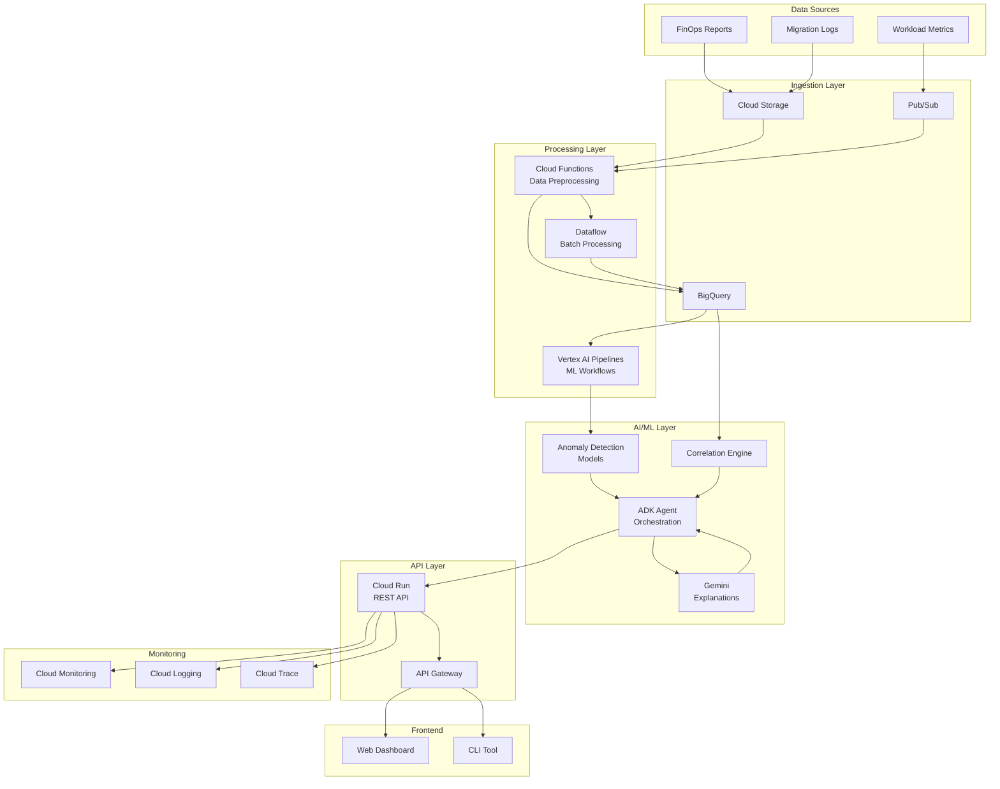
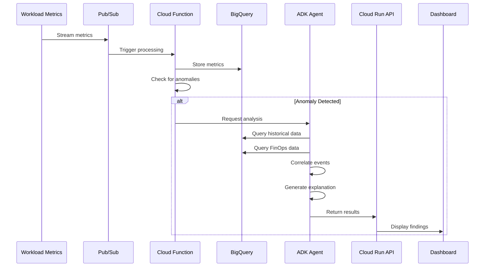
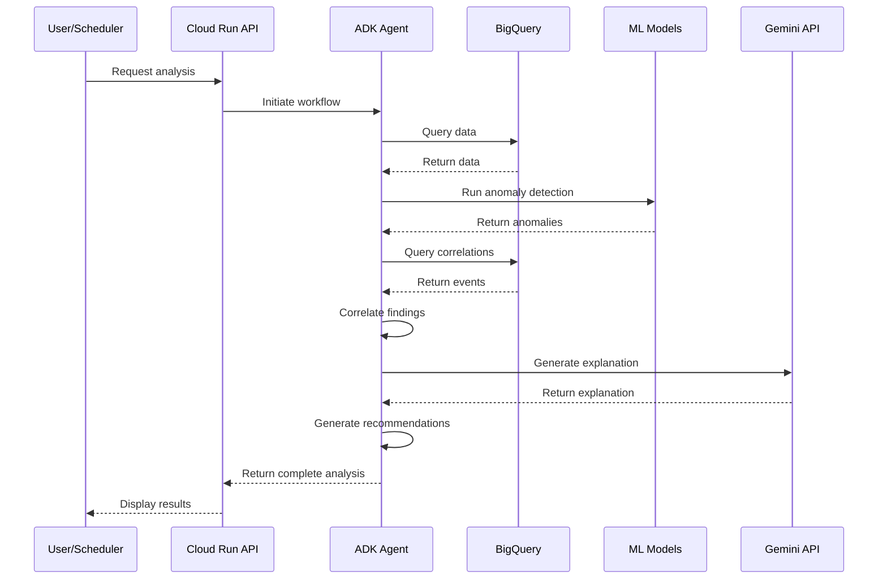
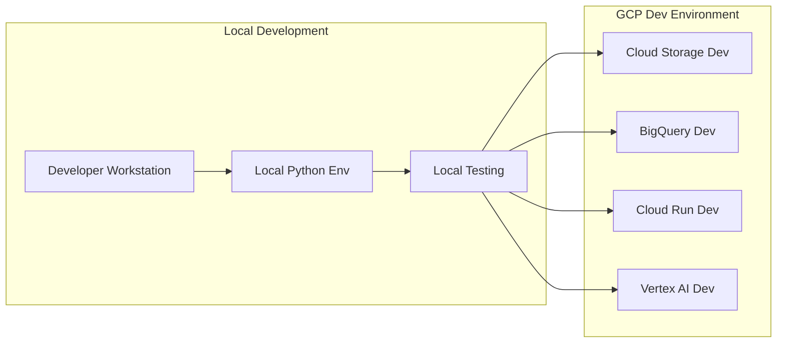
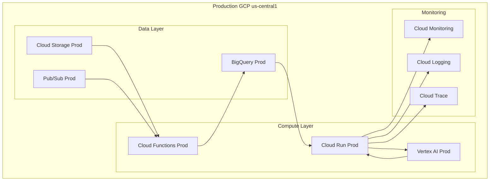
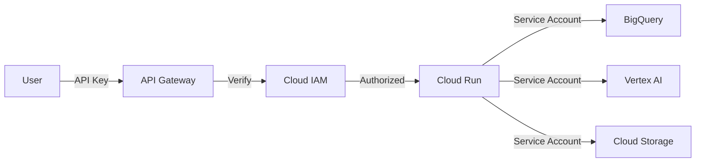

# Anomaly Detection System Architecture

## System Overview

The Anomaly Detection and Correlation Agentic Solution is designed to analyze volume spikes in operational and financial reports, correlate them with workload activities, and provide actionable recommendations in minutes instead of hours or days.

## High-Level Architecture



## Component Details

### 1. Data Sources

#### FinOps Reports
- **Source**: GCP Billing exports, custom cost reports
- **Format**: CSV, JSON
- **Frequency**: Daily batch, hourly incremental
- **Storage**: Cloud Storage → BigQuery

#### Workload Metrics
- **Source**: Cloud Monitoring, Kubernetes metrics, application logs
- **Format**: JSON, Prometheus format
- **Frequency**: Real-time streaming
- **Storage**: Pub/Sub → BigQuery

#### Migration Logs
- **Source**: Change management systems, deployment logs
- **Format**: Structured logs (JSON)
- **Frequency**: Event-driven
- **Storage**: Cloud Storage

### 2. Ingestion Layer

#### Cloud Storage
- **Purpose**: Landing zone for batch data
- **Bucket Structure**:
  ```
  gs://ccibt-hack25ww7-730-data/
  ├── finops/
  │   ├── raw/YYYY/MM/DD/
  │   └── processed/YYYY/MM/DD/
  ├── workload-metrics/
  │   ├── raw/YYYY/MM/DD/
  │   └── processed/YYYY/MM/DD/
  └── migration-logs/
      └── YYYY/MM/DD/
  ```

#### Pub/Sub
- **Purpose**: Real-time data streaming
- **Topics**:
  - `workload-metrics-stream`
  - `anomaly-alerts`
  - `correlation-events`

#### BigQuery
- **Purpose**: Data warehouse and analytics
- **Datasets**:
  - `finops_data`: Cost and usage data
  - `workload_metrics`: Performance metrics
  - `anomaly_results`: Detection results
  - `correlations`: Correlation analysis

### 3. Processing Layer

#### Cloud Functions
- **Functions**:
  - `ingest-finops-data`: Process FinOps reports
  - `ingest-workload-metrics`: Process workload metrics
  - `preprocess-data`: Clean and normalize data
  - `trigger-analysis`: Trigger anomaly detection

#### Dataflow (Optional)
- **Purpose**: Large-scale batch processing
- **Jobs**:
  - Historical data backfill
  - Complex data transformations
  - Aggregation pipelines

#### Vertex AI Pipelines
- **Purpose**: ML workflow orchestration
- **Pipelines**:
  - Model training pipeline
  - Batch inference pipeline
  - Model evaluation pipeline

### 4. AI/ML Layer

#### ADK Agent (Primary)
```python
# Agent Architecture
Agent Components:
├── Reasoning Engine (Gemini 1.5 Pro)
├── Tools:
│   ├── analyze_volume_spike()
│   ├── query_finops_data()
│   ├── query_workload_metrics()
│   ├── correlate_events()
│   ├── generate_recommendations()
│   └── explain_findings()
├── Memory: Conversation history and context
└── Orchestration: Multi-step reasoning workflow
```

**Agent Workflow**:
1. Receive anomaly detection request
2. Query relevant data from BigQuery
3. Analyze volume spike patterns
4. Correlate with workload events
5. Generate explanations using Gemini
6. Provide actionable recommendations

#### Anomaly Detection Models

**Statistical Methods**:
- Z-Score Analysis
- IQR (Interquartile Range)
- Moving Average Deviation
- Seasonal Decomposition

**ML Models**:
- Isolation Forest (scikit-learn)
- LSTM Autoencoder (TensorFlow/PyTorch)
- Prophet (time-series forecasting)

**Model Selection Logic**:
```python
if data_has_seasonality:
    use Prophet or Seasonal Decomposition
elif multivariate_analysis:
    use Isolation Forest
elif time_series_patterns:
    use LSTM Autoencoder
else:
    use Z-Score or IQR
```

#### Correlation Engine

**Correlation Methods**:
1. **Temporal Correlation**: Time-based event matching
2. **Statistical Correlation**: Pearson/Spearman coefficients
3. **Causal Analysis**: Granger causality tests
4. **Pattern Matching**: Similar event patterns

**Correlation Confidence Scoring**:
```python
confidence_score = (
    temporal_proximity * 0.3 +
    statistical_correlation * 0.3 +
    pattern_similarity * 0.2 +
    domain_knowledge * 0.2
)
```

#### Gemini Integration

**Use Cases**:
- Natural language explanations of anomalies
- Recommendation generation
- Report summarization
- Interactive Q&A about findings

### 5. API Layer

#### Cloud Run Service

**Endpoints**:
```
POST   /api/v1/anomalies/detect
GET    /api/v1/anomalies/{id}
GET    /api/v1/anomalies
POST   /api/v1/correlations/analyze
GET    /api/v1/reports/{id}
POST   /api/v1/agent/query
```

**Service Configuration**:
- Min instances: 1
- Max instances: 10
- CPU: 2 vCPU
- Memory: 4 GB
- Timeout: 300s
- Concurrency: 80

#### API Gateway

**Features**:
- Rate limiting
- API key authentication
- Request/response logging
- CORS configuration

### 6. Monitoring & Observability

#### Cloud Monitoring

**Key Metrics**:
- API latency (p50, p95, p99)
- Error rate
- Anomaly detection rate
- Correlation accuracy
- Cost per analysis

**Dashboards**:
- System health dashboard
- Business metrics dashboard
- Cost tracking dashboard

#### Cloud Logging

**Log Categories**:
- Application logs
- Audit logs
- Error logs
- Performance logs

**Log Retention**:
- Application logs: 30 days
- Audit logs: 90 days
- Error logs: 60 days

#### Cloud Trace

**Tracing**:
- End-to-end request tracing
- Service dependency mapping
- Performance bottleneck identification

## Data Flow

### Real-Time Anomaly Detection Flow



### Batch Analysis Flow



## Deployment Architecture

### Development Environment



### Production Environment



## Security Architecture

### Authentication & Authorization



### Network Security

- **VPC**: Custom VPC with private subnets
- **Firewall Rules**: Restrict ingress to necessary ports
- **Cloud Armor**: DDoS protection for API Gateway
- **Private Google Access**: For internal service communication

### Data Security

- **Encryption at Rest**: Google-managed keys
- **Encryption in Transit**: TLS 1.3
- **DLP**: Scan for PII in data sources
- **Access Logging**: All data access logged

## Scalability Considerations

### Horizontal Scaling

- **Cloud Run**: Auto-scales based on request load
- **Cloud Functions**: Concurrent execution up to quota
- **BigQuery**: Automatically scales for queries
- **Pub/Sub**: Handles millions of messages/second

### Vertical Scaling

- **Cloud Run**: Increase CPU/memory per instance
- **BigQuery**: Use BI Engine for faster queries
- **Vertex AI**: Use larger machine types for training

### Performance Optimization

1. **Caching**:
   - Redis/Memorystore for frequently accessed data
   - BigQuery BI Engine for dashboard queries

2. **Query Optimization**:
   - Partitioned tables by date
   - Clustered tables by resource_id
   - Materialized views for common queries

3. **Batch Processing**:
   - Process data in micro-batches
   - Use streaming inserts for real-time data

## Disaster Recovery

### Backup Strategy

- **BigQuery**: Daily snapshots, 7-day retention
- **Cloud Storage**: Versioning enabled
- **Terraform State**: Backed up to separate bucket
- **Code**: Git repository with multiple remotes

### Recovery Procedures

1. **Data Loss**: Restore from BigQuery snapshots
2. **Service Outage**: Redeploy from Terraform
3. **Configuration Error**: Rollback to previous version
4. **Complete Failure**: Restore from backup in different region

### RTO/RPO

- **RTO**: 4 hours (time to restore service)
- **RPO**: 24 hours (acceptable data loss)

## Cost Optimization

### Cost Breakdown (Estimated)

```
Monthly Costs (Development):
├── BigQuery: $50-100
├── Cloud Storage: $10-20
├── Cloud Run: $20-40
├── Vertex AI: $100-200
├── Cloud Functions: $10-20
├── Networking: $5-10
└── Total: ~$195-390/month

Monthly Costs (Production):
├── BigQuery: $200-500
├── Cloud Storage: $50-100
├── Cloud Run: $100-200
├── Vertex AI: $500-1000
├── Cloud Functions: $50-100
├── Networking: $20-50
└── Total: ~$920-1950/month
```

### Cost Optimization Strategies

1. **BigQuery**:
   - Use partitioned tables
   - Set query cost limits
   - Use flat-rate pricing for predictable workloads

2. **Cloud Storage**:
   - Use lifecycle policies
   - Archive old data to Coldline/Archive
   - Delete temporary files

3. **Compute**:
   - Use autoscaling
   - Set min instances to 0 for dev
   - Use committed use discounts

4. **Vertex AI**:
   - Use preemptible instances for training
   - Optimize model size
   - Cache predictions

## Technology Stack

### Backend
- **Language**: Python 3.14
- **Framework**: FastAPI
- **AI/ML**: ADK, Vertex AI, scikit-learn, TensorFlow
- **Data**: BigQuery, Pandas, NumPy

### Infrastructure
- **IaC**: Terraform
- **Container**: Docker
- **Orchestration**: Cloud Run, Vertex AI Pipelines

### Monitoring
- **Metrics**: Cloud Monitoring
- **Logs**: Cloud Logging
- **Tracing**: Cloud Trace
- **Alerting**: Cloud Monitoring Alerts

### Development
- **Version Control**: Git
- **CI/CD**: Cloud Build
- **Testing**: pytest, unittest
- **Linting**: ruff, black

## Future Enhancements

### Phase 2 Features
- Multi-cloud support (AWS, Azure)
- Advanced ML models (Transformers)
- Real-time streaming dashboard
- Mobile application
- Slack/Teams integration

### Scalability Improvements
- Multi-region deployment
- Global load balancing
- Edge caching with Cloud CDN
- Kubernetes for complex workloads

### AI Enhancements
- Fine-tuned models for specific domains
- Reinforcement learning for recommendations
- Automated model retraining
- Explainable AI (XAI) features

---

**Document Version**: 1.0  
**Last Updated**: 2024-12-16  
**Maintained By**: Hackathon Team